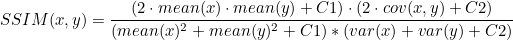

# Flutter Image Compare - SSIM
This is a Flutter project that provides an implementation of the Structural Similarity Index (SSIM) algorithm for comparing images. The SSIM algorithm is a widely used method for measuring the similarity between two images. It takes into account factors such as luminance, contrast, and structure to provide a more accurate comparison than traditional pixel-based methods.

The SSIM index calculation involves comparing the mean luminance, variance, and covariance of the two images.

Luminance refers to the brightness or intensity of the pixels in the image. Contrast refers to the range of intensity values in the image. Structure refers to the spatial layout of the pixels in the image.

The formula for calculating the SSIM score is:

Here, x and y are the two images being compared, mean(x) and mean(y) are the mean luminance values of the two images, cov(x, y) is the covariance of the two images, and var(x) and var(y) are the variances of the two images.

C1 and C2 are constants added to the formula to prevent division by zero. They are chosen to be small positive values.

The SSIM score ranges from -1 to 1, where 1 means the images are identical and -1 means they are completely different.
